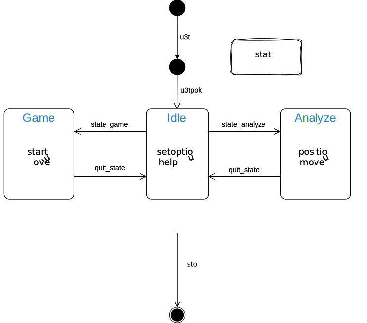

# Ultimate tic-tac-toe Protocol

## Table of Contents
1. [Overview](#overview)
2. [State diagram](#state-diagram)
3. [Handshake](#handshake)
4. [Commands](#commands)
5. [License](#license)
6. [Author](#author)

## Overview
Define a set of text messages that can be sent to and from an engine using the stdint and stdout.

Each command can followed by a variable number of parameters. \
Each parameter has a default value defined by this standard. \
The parameters that don't have a default value are required to be set every time. \
The parameters after the command doesn't need to follow an established order.

The standard message will look like: \
`[command] param: {param1: param1 value, param2: {param21: param21 value, param22: param22 value}} data: [data]`

Every message must be termianted with `'\n'` (OS dependent). 

If a message doesn't comply with this standard or it's incopatible with the state of the engine it is ignored.

The I/O can be managed by the engine not in real time, but at the end of the current task.

## State diagram

## Handshake:
At the start of every connection the client will send to the engine the message: \
`u3tp`

The engine has a certain amount of time (implementation dependent: suggested 30 seconds) to respond with: \
`u3tpok`

If the engine fails to do so the engine is forcefully shut down. \
If the engine succesfully responds it enter idle mode waiting for more commands.

## Commands:
Below are listed all the commands the client can send to the engine.

### `u3tp`
Start the handshake.

### `u3tpok`
Succesful response to the handshake.

### `state_game`
Switch to game state.

### `state_analyze`
Switch to analyze state.

### `quit_state`
Clear all internal state and return in idle state.

### `start`
Start the game.

### `position`
Set a new analysis board and evaluate it.

### `move`
Make a move on the board.

### `setoption`
Modify internal setting of the engine.

### `help`
Display a brief text explanation of the commands and the usage of the engine.

### `state`
Ask the engine in which state is in.

### `stop`
Quit the engine as fast as possible.

## License
GPL v3

## Author
Davide Fassio
